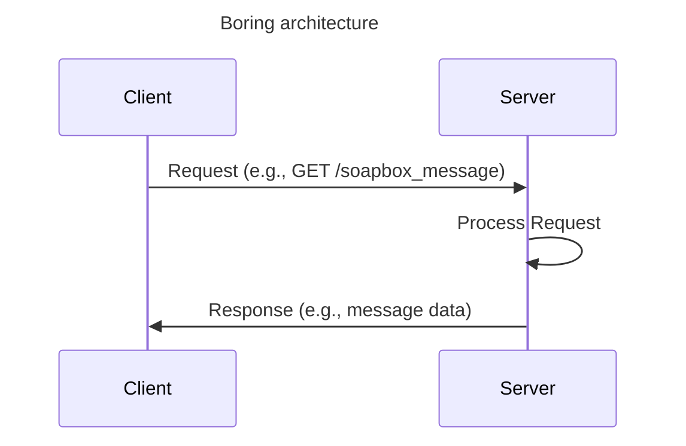
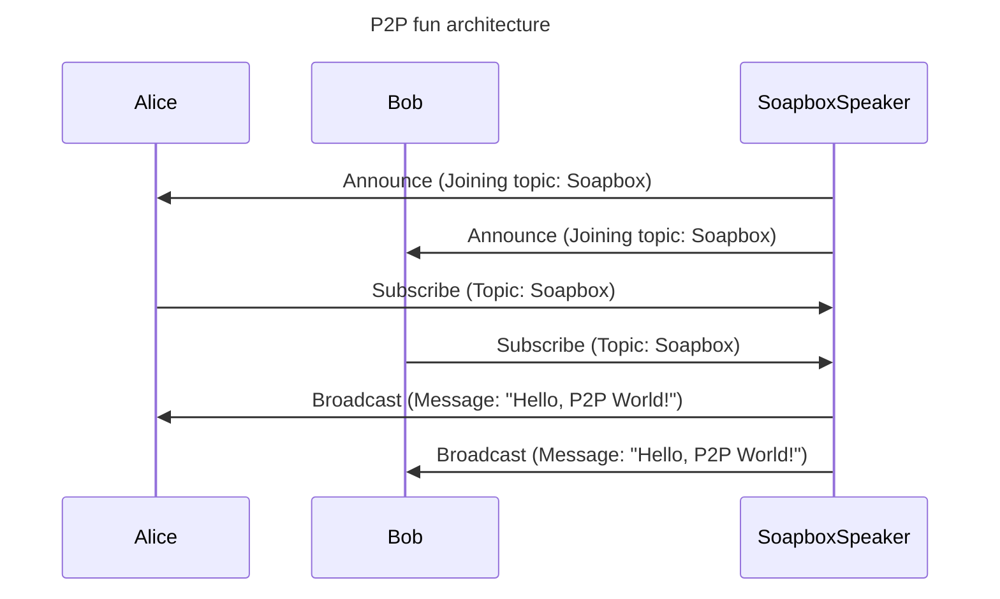

# p2p Soapbox

This is a very simple p2p application capable of making everybody listen to whatever you are willing to type in the terminal....

Not a lot of fun but! this thing doesn't use any servers or man in the middle to achieve that!

## How to use it?

```bash
npm install

# npm start <mode> [<topic>]

# Soapbox
# This will output a topic id that you will need to listen to this soapbox
npm start tx
> Topic: <soapbox-topic-id>

# Listener
npm start rx <soapbox-topic-id>

```

## How a boring architecture whould look



In a traditional non-`P2P` architecture, there would exist a `Server` in charge of keeping track of connected `Clients` and broadcasting the messages to all of them as they arrive. So the message journey is `Client -> Server -> Client`.

This is not only boring but also lacks a huge sense of freedom and privacy. If you want to send a message, you are obligated to use that `Server`, and it is not really required!!!

## The fun of p2p



In a `P2P` architecture, there are only `Peers` (Alice, Bob, ... Soapbox Speaker). These peers agree to connect to each other because they are interested in a topic. There is no `Server`, so the data is `peer to peer`.

This is not only fun, but it also provides ownership of your data. You can decide who can read your stuff, and you don't need to pay for unneeded, boring `Servers`.